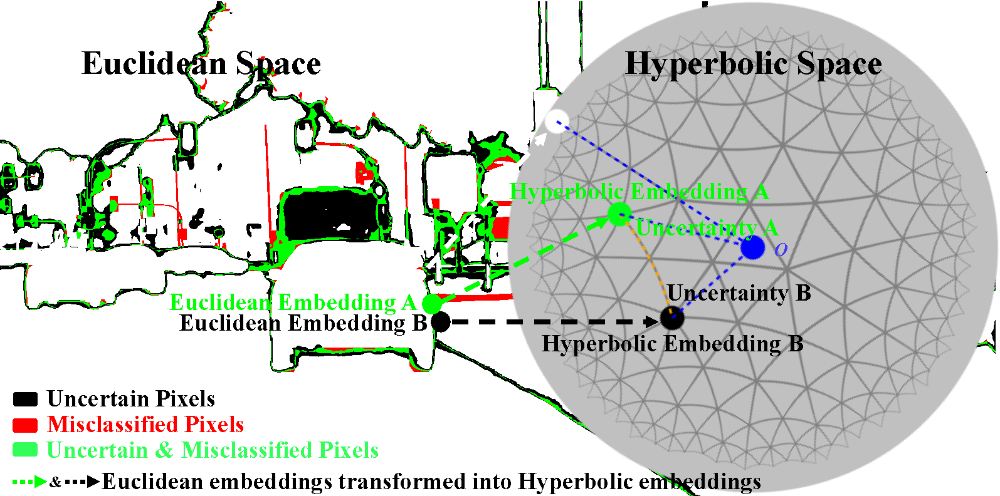

## HyperUL

The repository contains  the related code for the paper, "*Hyperbolic Uncertainty Aware Semantic Segmentation*". 

<div align=center>

</div>


The SegFormer-B0 is used as the semantic image segmentation model. Besides, I do not intend to provide the whole code, because previous models cannot achieve optimal performance due to the lack of various data augmentation techniques.  

However, I plan to submit the newly developed semantic image segmentation code to the other repository. Also, I will paste the link here. 

 

If you have any questions, please drop me an email, "*bike.chen@oulu.fi*". Please note that you email might be filtered as the trash email, and then I may not reply to you immediately. 


##### References

[1] https://github.com/leymir/hyperbolic-image-embeddings

[2] https://github.com/geoopt/geoopt


##### BibTeX:

```bash
@article{hyperul2024,
  author={Chen, Bike and Peng, Wei and Cao, Xiaofeng and Röning, Juha},
  journal={IEEE Transactions on Intelligent Transportation Systems}, 
  title={Hyperbolic Uncertainty Aware Semantic Segmentation}, 
  year={2024},
  volume={25},
  number={2},
  pages={1275-1290},
  keywords={Uncertainty;Training;Estimation;Computational modeling;Semantic segmentation;Drones;Task analysis;Hyperbolic space;hyperbolic uncertainty estimation;semantic segmentation;self-driving cars;autonomous drones},
  doi={10.1109/TITS.2023.3312290}}
```

